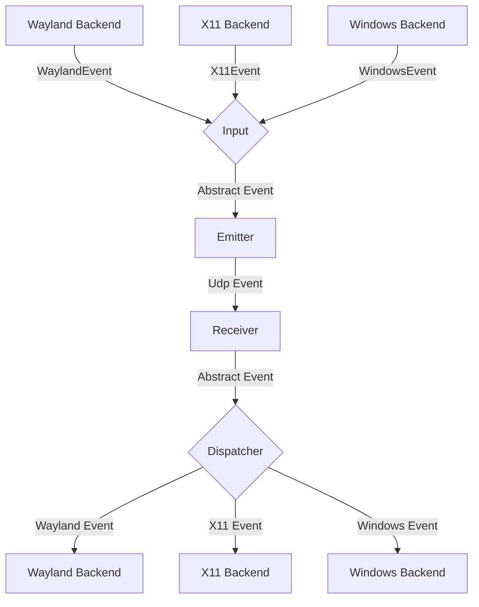
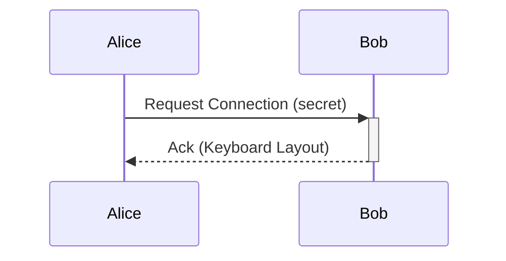

# General Software Architecture

## Events

Each instance of lan-mouse can emit and receive events, where
an event is either a mouse or keyboard event for now.

The general Architecture is shown in the following flow chart:

### Input
The input component is responsible for translating inputs from a given backend
to a standardized format and passing them to the event emitter.

### Emitter
The event emitter serializes events and sends them over the network
to the correct client.

### Receiver
The receiver receives events over the network and deserializes them into
the standardized event format.

### Dispatcher
The dispatcher component takes events from the event receiver and passes them
to the correct backend corresponding to the type of client.

## Keyboard repeat over a jittery network

Updated macOS peers generate repeats on the sending Mac, using its keyboard
repeat delay and interval. The receiver injects only those explicit repeats;
a delayed key-up no longer lets a receiver timer invent extra characters. The
sender processes captured input before repeat timers and skips missed timer
ticks after a stall. Modifiers never start a repeat timer.

This requires updated builds on **both Macs**. The `Capabilities` byte uses bit 0
for positioned entry and bit 1 for source-timed keyboard repeat. Keyboard state
0 is release, 1 is a legacy press with receiver repeat, 2 is an explicit repeat,
and 3 is a press without receiver repeat. State 3 is sent only to receivers that
advertise support; explicit repeats are omitted for older receivers, which keep
their existing local repeat behavior. Repeats are accepted only for a held state-3
key, so a late repeat after release is ignored. Protocol crate version: 0.4.0.

UDP/DTLS still does not guarantee delivery or ordering. Intentional repeats
already in flight can arrive late, and lost releases can still leave a key or
modifier held until cleanup. Reliable keyboard delivery/state synchronization
is separate follow-up work.

Manual verification on two updated Macs: tap keys while the network is delayed
(the peer should show one character per delivered tap), hold a key (repeat should
follow the sending Mac's settings), release it, exercise Shift/Command chords,
and leave/disconnect while holding keys. Also verify a connection to an older
build keeps intentional key repeat working. Automated tests cover sender stalls,
release before repeat-task startup, negotiation, repeat filtering, and shutdown
key/modifier cleanup without injecting real input.

## Option shortcuts on macOS

The macOS receiver preserves left/right Option key flags when posting keyboard
events. iTerm2's extended keyboard protocol uses these flags to recognize Alt,
so the generic Option flag alone can work in a plain shell but fail in terminal
apps using that protocol. Modifier-only input without a known side defaults to
left Option. Key release and modifier resets clear the side information.

## Experimental virtual-HID compatibility test

A standalone [macOS virtual-HID probe](experiments/macos-virtual-hid/README.md)
can test whether Universal Control forwards virtual keyboard and mouse input to
an iPad. It uses an already-installed Karabiner driver and requires a local
administrator to run it. This is a diagnostic experiment, not an input-emulation
backend or a claim of Universal Control support.

## Requests

// TODO this currently works differently

Aside from events, requests can be sent via a simple protocol.
For this, a simple tcp server is listening on the same port as the udp
event receiver and accepts requests for connecting to a device or to
request the keymap of a device.

## Problems
The general Idea is to have a bidirectional connection by default, meaning
any connected device can not only receive events but also send events back.

This way when connecting e.g. a PC to a Laptop, either device can be used
to control the other.

It needs to be ensured, that whenever a device is controlled the controlled
device does not transmit the events back to the original sender.
Otherwise events are multiplied and either one of the instances crashes.

To keep the implementation of input backends simple this needs to be handled
on the server level.

## Device State - Active and Inactive
To solve this problem, each device can be in exactly two states:

Either events are sent or received.

This ensures that
- a) Events can never result in a feedback loop.
- b) As soon as a virtual input enters another client, lan-mouse will stop receiving events,
which ensures clients can only be controlled directly and not indirectly through other clients.

## macOS shared mouse profile (development)

The macOS daemon can replicate an opt-in Mac Mouse Fix configuration-format-24
profile over its existing DTLS connections. The native Mouse panel exposes scrolling and click/double-click/hold button
actions; existing advanced MMF remaps and pointer settings are preserved. Its
modified engine is bundled privately inside Lan Mouse Control, with no separate
MMF app or menu icon to manage. See [MMF integration status](macos-ui/MMF-INTEGRATION.md)
for build and installation details. Sync must be enabled on both Macs.

State lives at `~/.config/lan-mouse/mouse-profile.json`. Only `Scroll`, `Pointer`,
`Remaps`, and the three behavior preferences `General.buttonKillSwitch`,
`General.scrollKillSwitch`, `General.lockPointerDuringDrag` are transferred.
License data, permissions, identity, device-local UI, screen arrangement, and
Lan Mouse's per-peer key map are not transferred. Format mismatch or invalid
required fields prevents writes. A first-change backup is created beside the
MMF configuration; the control panel and daemon use a shared advisory lock,
atomic file replacement, and a best-effort concurrent MMF-edit check.

Replication polls every two seconds while a connection exists, without requiring
the control panel. Both endpoints must approve the presented peer certificate,
including the outbound endpoint, before sending or accepting profile data.
Revoking trust stops further sync on existing sessions. This additional settings
check does not change the legacy input channel's server-verification policy.

The additive side protocol is `LMMP\x01` followed by a message kind: `0` hello,
`1` chunk, `2` acknowledgement. Chunk fields are SHA-256 (32 bytes), index,
count and payload length (each a big-endian u16), then up to 900 payload bytes.
Profiles are limited to 64 KiB, partial assemblies expire after ten seconds, and
incomplete/unacknowledged profiles retry every two seconds. Old peers ignore the
unknown hello; profile chunks are sent only after a matching hello received
within the last six seconds, so turning off sync stops peer retransmission. This is a
separately versioned extension; existing `ProtoEvent` serialization is unchanged.

Every local edit advances a logical revision. Peers converge on the greatest
`(revision, author)` pair, using a stable random node ID to break ties. Conflicts
choose a whole profile, not a per-field merge and not wall-clock recency. Edits
made offline are detected on reconnection. A first-time setup must deliberately
seed the preferred Mac's profile; independently enabling two profiles at revision
one otherwise resolves by node ID. This initialization is not yet integrated
into pairing. Disabling sync retains the last applied settings on each Mac.

### Integrated mouse drag zoom (custom macOS build)

In Lan Mouse Control → Mouse → Buttons, a **Click and Drag** gesture can use
**Zoom In or Out**. Hold its assigned mouse button and drag up/down to zoom
in/out; release to finish. It can coexist with that button’s scroll-wheel zoom
action. Both Macs need the updated bundled mouse engine and sharing service
to synchronize this custom action. See `macos-ui/MMF-INTEGRATION.md` for build
and validation details.

### macOS sharing shortcut IPC

The native control panel registers a global hotkey locally and renews
`{"SetSharingShortcut":{"key_code":40,"modifiers":786432}}` over local IPC
while connected. `key_code` is a macOS virtual key code; `modifiers` uses NSEvent
Shift/Control/Option/Command bits 17–20. `{"SetSharingShortcut":null}` clears it.
The lease lasts ten seconds. During input capture, a matching key-down releases
forwarded keys and capture, then emits
`{"SharingShortcutPressed":{"key_code":40,"modifiers":786432}}`. The native
frontend toggles the launch agent. This additive local IPC extension does not
change the peer wire protocol; install matching daemon/control-panel builds.

### Native file-drag bridge

macOS control panels use `SetFileDragReady(bool)` (a 1500 ms capture lease),
`PrepareFileDrag(handle)` to connect before capture,
`StartFileDragFrom { handle, source_pid }`, and `CaptureEntered { handle }` on local IPC. Existing
left-button drags may cross only while the lease is live. The held button is
adopted after Enter acknowledgement and released on capture cancellation. File
bridge v2 uses left-button state `BUTTON_ADOPT_FILE_DRAG` (2): macOS tracks the
held button without posting a global mouse-down, so crossing beside an app border
cannot start resizing that window. Once its temporary source window is visible,
the native relay requests `BeginNativeFileDrag { pid, window, x, y }` on local IPC
(coordinates are Quartz screen points). The authorized daemon verifies that the
requested process and window cover that point, then posts the initial press through
the normal HID event path. Process-addressed mouse-downs do not establish the global
held-button state needed by AppKit dragging. Native startup may claim a held file
button only once; release invalidates the claim so delayed UI requests cannot
resurrect a drag. The UI retries startup while waiting for its window to appear.
`CancelNativeFileDrag { pid }` sends a process-local
Escape if the relay is abandoned. Button-up, capture cancellation, and receiver
teardown release the drag. The UI also cancels sessions that fail to start, fail
to finish after release, lose their connection, or outlive the transfer timeout.
The daemon sends a process-addressed Escape to the originating app using its
existing Accessibility grant, ending the source drag without forwarding Escape
to the receiving Mac. The older `StartFileDrag(handle)` request remains accepted
for older local frontends but does not cancel the source drag.

Chrome tab handoff reuses this flow without protocol changes. The control panel
detects a Chrome link drag (a `public.url` drag pasteboard) or a pulled-out tab
(Chrome's focused one-tab window moving without resizing, read via
Accessibility). It then sends a JSON `{url, profile}` file with the
`.lanmouse-url` extension. On `CaptureEntered` it activates the transfer and
sends `CancelNativeFileDrag { pid }` for Chrome instead of `StartFileDragFrom`,
so no button is adopted remotely. The receiving panel opens `http`/`https` URLs
from authorized peers only, with `--profile-directory` resolved by profile name
from Chrome's `Local State`.

The opt-in file channel uses `LMFD\x02` framed datagrams on the existing approved
DTLS connection; old peers ignore these oversized extension packets. Both peers
must send matching v2 capability heartbeats before file offers are accepted;
install the updated daemon on both Macs. One regular file
up to 64 MiB is transferred in 900-byte chunks with a bounded 32-chunk send window,
acknowledgements, retransmission, filename validation and a SHA-256 check. Fully
acknowledged windows advance after a minimum 2 ms spacing instead of waiting for
the idle 20 ms timer. Each datagram yields to other tasks; the window remains
bounded. File I/O
runs outside the input receive loop. Activations are idempotent and never run a
shell command or submit an agent prompt. See `macos-ui/README.md` for the gesture,
retention location and current limits.
